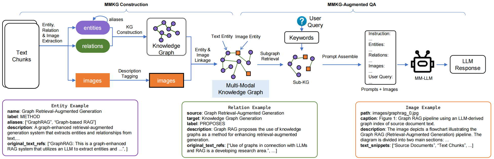

# Multi-Modal Knowledge Graph RAG

Official code for article "MMKG-RAG: Retrieval-Augmented Generation with Multi-modal Knowledge Graph".

MMKG-RAG is a **Multi-Modal Knowledge Graph (MMKG)-based RAG system** for multi-modal retrieval and QA. It builds **comprehensive MMKGs** to capture rich cross-modal semantics, enabling **stronger multi-modal understanding, retrieval, and cross-modal reasoning** than conventional text-centric RAG or multi-modal LLMs without an MMKG.



## Example

[System Demo Video](./assets/mmkg-rag-recording.mp4)

[](https://www.youtube.com/watch?v=9NdHGnSZpXE)

The details of the example can be found in [examples folder](./examples/rag/).

## Quick Start

### Step 1: Install the requirements


```bash
pip install -r requirements.txt
```

Create a `.env` file in the root directory and add the following environment variables:

```bash
# LLM
BASE_URL=https://api.openai.com/v1
API_KEY=sk-1234567890
LLM_MODEL=gpt-4o-mini

# Neo4J
# comment the following three lines if you don't have a neo4j instance
NEO4J_URI=neo4j://127.0.0.1:7687 
NEO4J_USER=neo4j
NEO4J_PASSWORD=password-neo4j
```

### Step 2: Try the example

```bash
python main.py
```

Open the browser and visit `http://127.0.0.1:7860/`.

## Start by Docker

```bash
docker pull ghcr.io/wenzhaoabc/mmkg-rag:v0.1.0

docker run -p 7860:7860 --env-file .env ghcr.io/wenzhaoabc/mmkg-rag:v0.1.0
```

`logs` folder will be created in the root directory to store the logs. You can project the logs to the host machine by mounting the volume.

```bash
docker run -p 7860:7860 --env-file .env -v $(pwd)/log:/app/logs ghcr.io/wenzhaoabc/mmkg-rag:v0.1.0
```

## Folder Structure

```txt
src/mmkg_rag
├─gui           # GUI components
├─index         # MMKG Construction
├─retrieval     # Retrieval and generation
├─storage       # Storage components
├─types         # Type definitions
└─utils         # Utility functions
```

## Known Issues

- Sometimes `/gradio_api/file=` does not work with Docker, which can result in images not being rendered. You can try using the local version instead. (See [Gradio Issue](https://github.com/gradio-app/gradio/issues/10180))

## Related Projects

- [GraphRAG](https://github.com/microsoft/graphrag)
- [LightRAG](https://github.com/HKUDS/LightRAG)

## License

[MIT](./LICENSE)

## Citation

```bib
@inproceedings{10.1007/978-981-95-4158-4_37,
    author = {Zhao, Shuaitao and Luo, Shijie and Lu, Xinyuan and Rao, Weixiong},
    title = {MMKG-RAG: Retrieval-Augmented Generation with&nbsp;Multi-modal Knowledge Graph},
    year = {2026},
    url = {https://doi.org/10.1007/978-981-95-4158-4_37},
    doi = {10.1007/978-981-95-4158-4_37},
}
```
