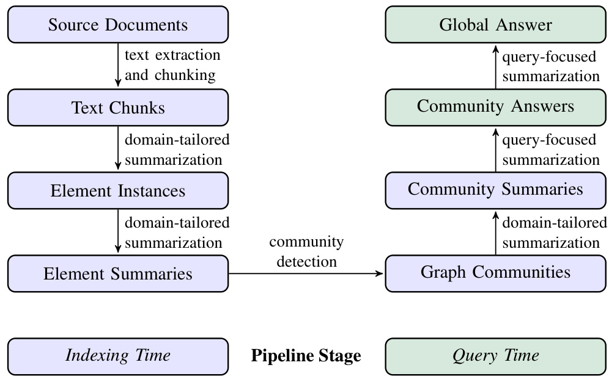
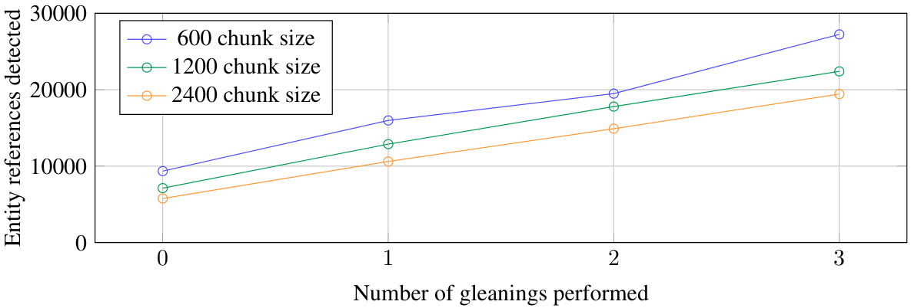
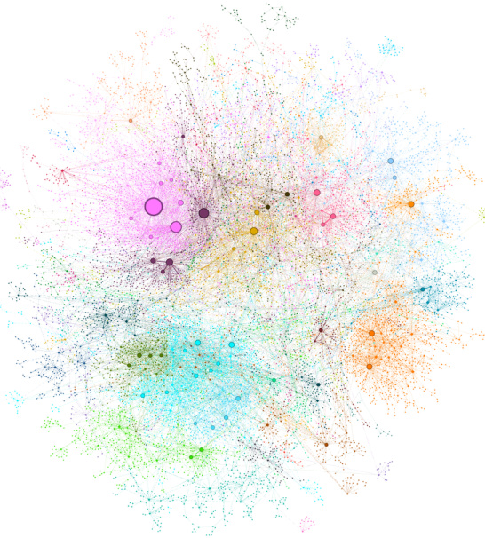
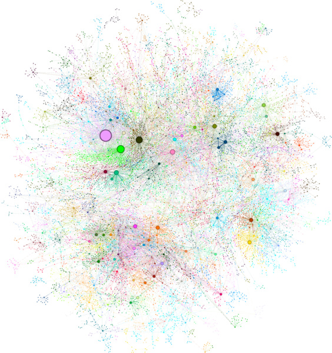
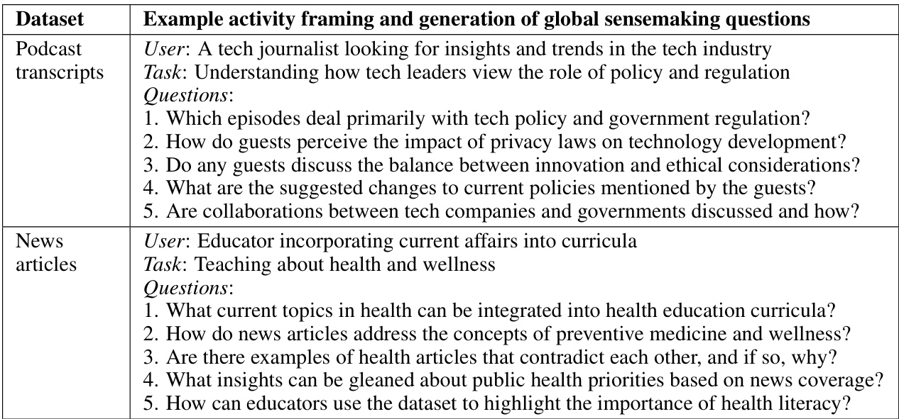
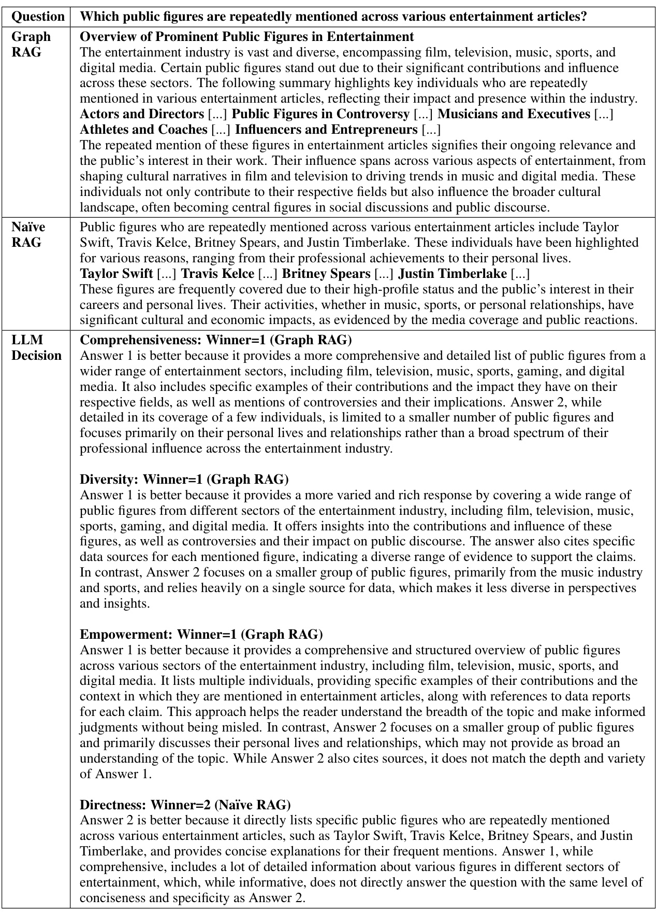
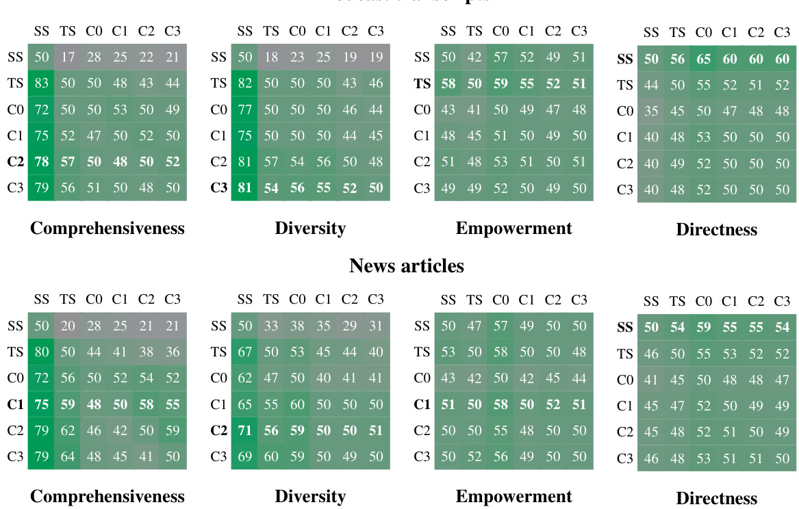
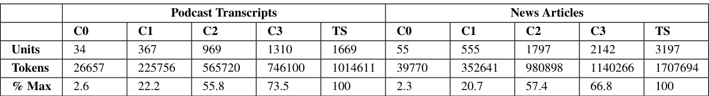

# From Local to Global: A Graph RAG Approach to Query-Focused Summarization  

# Darren Edge1 Ha Trinh1 Newman Cheng? Joshua Bradley2 Alex Chao3  

Apurva Mody3  

Steven Truitt?  

Jonathan Larson'  

1 Microsoft Research 2Microsoft Strategic Missions and Technologies 3Microsoft Office of the CTO  

{daedge,trinhha,newmancheng, joshbradley,achao,moapurva, steventruitt, jolarso} @microsoft. com  

These authors contributed equally to this work  

# Abstract  

The use of retrieval-augmented generation (RAG) to retrieve relevant information from an external knowledge source enables large language models (LLMs) to answer questions over private and/or previously unseen document collections. However, RAG fails on global questions directed at an entire text corpus, such as "What are the main themes in the dataset?", since this is inherently a queryfocused summarization (QFS) task, rather than an explicit retrieval task. Prior QFS methods, meanwhile, fail to scale to the quantities of text indexed by typical RAG systems. To combine the strengths of these contrasting methods, we propose a Graph RAG approach to question answering over private text corpora that scales with both the generality of user questions and the quantity of source text to be indexed. Our approach uses an LLM to build a graph-based text index in two stages: first to derive an entity knowledge graph from the source documents, then to pregenerate community summaries for all groups of closely-related entities. Given a question, each community summary is used to generate a partial response, before all partial responses are again summarized in a final response to the user. For a. class of global sensemaking questions over datasets in the 1 million token range, we show that Graph RAG leads to substantial improvements over a naive RAG baseline for both the comprehensiveness and diversity of generated answers. An open-source, Python-based implementation of both global and local Graph RAG approaches is forthcoming at https: //aka.ms/graphrag.  

# 1 Introduction  

Human endeavors across a range of domains rely on our ability to read and reason about large collections of documents, often reaching conclusions that go beyond anything stated in the source texts themselves. With the emergence of large language models (LLMs), we are already witnessing attempts to automate human-like sensemaking in complex domains like scientific discovery (Microsoft, 2023) and intelligence analysis (Ranade and Joshi, 2023), where sensemaking is defined as "a motivated, continuous effort to understand connections (which can be among people, places, and events) in order to anticipate their trajectories and act effectively" (Klein et al., 2006a). Supporting human-led sensemaking over entire text corpora, however, needs a way for people to both apply and refine their mental model of the data (Klein et al., 2006b) by asking questions of a global nature..  

  
Figure 1: Graph RAG pipeline using an LLM-derived graph index of source document text. This index spans nodes (e.g., entities), edges (e.g., relationships), and covariates (e.g., claims) that have been detected, extracted, and summarized by LLM prompts tailored to the domain of the dataset. Community detection (e.g., Leiden, Traag et al., 2019) is used to partition the graph index into groups of elements (nodes, edges, covariates) that the LLM can summarize in parallel at both indexing time and query time. The "global answer' to a given query is produced using a final round of query-focused summarization over all community summaries reporting relevance to that query.  

Retrieval-augmented generation (RAG, Lewis et al., 2020) is an established approach to answering. user questions over entire datasets, but it is designed for situations where these answers are contained locally within regions of text whose retrieval provides sufficient grounding for the generation task. Instead, a more appropriate task framing is query-focused summarization (QFS, Dang, 2006), and in particular, query-focused abstractive summarization that generates natural language summaries and. not just concatenated excerpts (Baumel et al., 2018; Laskar et al., 2020; Yao et al., 2017) . In recent years, however, such distinctions between summarization tasks that are abstractive versus extractive, generic versus query-focused, and single-document versus multi-document, have become less relevant. While early applications of the transformer architecture showed substantial improvements on the state-of-the-art for all such summarization tasks (Goodwin et al., 2020; Laskar et al., 2022; Liu and Lapata, 2019), these tasks are now trivialized by modern LLMs, including the GPT (Achiam et al., 2023; Brown et al., 2020), Llama (Touvron et al., 2023), and Gemini (Anil et al., 2023) series, all of which can use in-context learning to summarize any content provided in their context window..  

The challenge remains, however, for query-focused abstractive summarization over an entire corpus. Such volumes of text can greatly exceed the limits of LLM context windows, and the expansion of such windows may not be enough given that information can be "lost in the middle' of longer contexts (Kuratov et al., 2024; Liu et al., 2023). In addition, although the direct retrieval of text chunks in naive RAG is likely inadequate for QFS tasks, it is possible that an alternative form of pre-indexing could support a new RAG approach specifically targeting global summarization.  

In this paper, we present a Graph RAG approach based on global summarization of an LLM-derived. knowledge graph (Figure 1). In contrast with related work that exploits the structured retrieval. and traversal affordances of graph indexes (subsection 4.2), we focus on a previously unexplored quality of graphs in this context: their inherent modularity (Newman, 2006) and the ability of com-. munity detection algorithms to partition graphs into modular communities of closely-related nodes (e.g., Louvain, Blondel et al., 2008; Leiden, Traag et al., 2019). LLM-generated summaries of these.  

  
Figure 2: How the entity references detected in the HotPotQA dataset (Yang et al., 2018) varies with chunk size and gleanings for our generic entity extraction prompt with gpt $-4$ t urbo.  

community descriptions provide complete coverage of the underlying graph index and the input documents it represents. Query-focused summarization of an entire corpus is then made possible using a map-reduce approach: first using each community summary to answer the query independently and in parallel, then summarizing all relevant partial answers into a final global answer.  

To evaluate this approach, we used an LLM to generate a diverse set of activity-centered sensemaking questions from short descriptions of two representative real-world datasets, containing podcast transcripts and news articles respectively. For the target qualities of comprehensiveness, diversity, and empowerment (defined in subsection 3.4) that develop understanding of broad issues and themes, we both explore the impact of varying the the hierarchical level of community summaries used to answer queries, as well as compare to naive RAG and global map-reduce summarization of source texts. We show that all global approaches outperform naive RAG on comprehensiveness and diversity, and that Graph RAG with intermediate- and low-level community summaries shows favorable performance over source text summarization on these same metrics, at lower token costs.  

# 2 Graph RAG Approach & Pipeline  

We now unpack the high-level data flow of the Graph RAG approach (Figure 1) and pipeline, describing key design parameters, techniques, and implementation details for each step.  

## 2.1 Source Documents $\rightarrow$ Text Chunks  

A fundamental design decision is the granularity with which input texts extracted from source documents should be split into text chunks for processing. In the following step, each of these chunks will be passed to a set of LLM prompts designed to extract the various elements of a graph index.. Longer text chunks require fewer LLM calls for such extraction, but suffer from the recall degrada-. tion of longer LLM context windows (Kuratov et al., 2024; Liu et al., 2023). This behavior can be observed in Figure 2 in the case of a single extraction round (i.e., with zero gleanings): on a sample dataset (HotPotQA, Yang et al., 2018), using a chunk size of 600 token extracted almost twice as many entity references as when using a chunk size of 2400. While more references are generally better, any extraction process needs to balance recall and precision for the target activity.  

## 2.2 Text Chunks $\rightarrow$ Element Instances  

The baseline requirement for this step is to identify and extract instances of graph nodes and edges from each chunk of source text. We do this using a multipart LLM prompt that first identifies all entities in the text, including their name, type, and description, before identifying all relationships between clearly-related entities, including the source and target entities and a description of their relationship. Both kinds of element instance are output in a single list of delimited tuples.  

The primary opportunity to tailor this prompt to the domain of the document corpus lies in the.   
choice of few-shot examples provided to the LLM for in-context learning (Brown et al., 2020).  

For example, while our default prompt extracting the broad class of "named entities' like people, places, and organizations is generally applicable, domains with specialized knowledge (e.g., science, medicine, law) will benefit from few-shot examples specialized to those domains. We also support a secondary extraction prompt for any additional covariates we would like to associate with the extracted node instances. Our default covariate prompt aims to extract claims linked to detected entities, including the subject, object, type, description, source text span, and start and end dates.  

To balance the needs of efficiency and quality, we use multiple rounds of "gleanings", up to a specified maximum, to encourage the LLM to detect any additional entities it may have missed on prior extraction rounds. This is a multi-stage process in which we first ask the LLM to assess whether all entities were extracted, using a logit bias of 100 to force a yes/no decision. If the LLM responds that entities were missed, then a continuation indicating that "MANY entities were missed in the last extraction' encourages the LLM to glean these missing entities. This approach allows us to use larger chunk sizes without a drop in quality (Figure 2) or the forced introduction of noise.  
 
## 2.3 Element Instances $\to$ Element Summaries

The use of an LLM to \*extract' descriptions of entities, relationships, and claims represented in source texts is already a form of abstractive summarization, relying on the LLM to create independently meaningful summaries of concepts that may be implied but not stated by the text itself (e.g., the presence of implied relationships). To convert all such instance-level summaries into single blocks of descriptive text for each graph element (i.e., entity node, relationship edge, and claim covariate) requires a further round of LLM summarization over matching groups of instances.  

A potential concern at this stage is that the LLM may not consistently extract references to the same entity in the same text format, resulting in duplicate entity elements and thus duplicate nodes in the entity graph. However, since all closely-related "communities" of entities will be detected and summarized in the following step, and given that LLMs can understand the common entity behind multiple name variations, our overall approach is resilient to such variations provided there is sufficient connectivity from all variations to a shared set of closely-related entities.  

Overall, our use of rich descriptive text for homogeneous nodes in a potentially noisy graph structure is aligned with both the capabilities of LLMs and the needs of global, query-focused summarization.. These qualities also differentiate our graph index from typical knowledge graphs, which rely on concise and consistent knowledge triples (subject, predicate, object) for downstream reasoning tasks.  

## 2.4 Element Summaries $\rightarrow$ Graph Communities  

The index created in the previous step can be modelled as an homogeneous undirected weighted graph in which entity nodes are connected by relationship edges, with edge weights representing the normalized counts of detected relationship instances. Given such a graph, a variety of community detection algorithms may be used to partition the graph into communities of nodes with stronger connections to one another than to the other nodes in the graph (e.g., see the surveys by Fortunato, 2010 and Jin et al., 2021). In our pipeline, we use Leiden (Traag et al., 2019) on account of its ability to recover hierarchical community structure of large-scale graphs efficiently (Figure 3). Each level of this hierarchy provides a community partition that covers the nodes of the graph in a mutually-exclusive, collective-exhaustive way, enabling divide-and-conquer global summarization.  

## 2.5Graph Communities $\rightarrow$ Community Summaries  

The next step is to create report-like summaries of each community in the Leiden hierarchy, using a method designed to scale to very large datasets. These summaries are independently useful in their own right as a way to understand the global structure and semantics of the dataset, and may themselves be used to make sense of a corpus in the absence of a question. For example, a user may scan through community summaries at one level looking for general themes of interest, then follow links to the reports at the lower level that provide more details for each of the subtopics. Here, however, we focus on their utility as part of a graph-based index used for answering global queries.  

Community summaries are generated in the following way:  

  
(a) Root communities at level 0  

  
(b) Sub-communities at level 1  

Figure 3: Graph communities detected using the Leiden algorithm (Traag et al., 2019) over the MultiHop-RAG (Tang and Yang, 2024) dataset as indexed. Circles represent entity nodes with size proportional to their degree. Node layout was performed via OpenORD (Martin et al., 2011) and Force Atlas 2 (Jacomy et al., 2014). Node colors represent entity communities, shown at two levels. of hierarchical clustering: (a) Level 0, corresponding to the hierarchical partition with maximum modularity, and (b) Level 1, which reveals internal structure within these root-level communities.  

: Leaf-level communities. The element summaries of a leaf-level community (nodes, edges,. covariates) are prioritized and then iteratively added to the LLM context window until the token limit is reached. The prioritization is as follows: for each community edge in. decreasing order of combined source and target node degree (i.e., overall prominance), add descriptions of the source node, target node, linked covariates, and the edge itself. - Higher-level communities. If all element summaries fit within the token limit of the con-. text window, proceed as for leaf-level communities and summarize all element summaries within the community. Otherwise, rank sub-communities in decreasing order of element summary tokens and iteratively substitute sub-community summaries (shorter) for their associated element summaries (longer) until fit within the context window is achieved..  

## 2.6Community Summaries $\rightarrow$ Community Answers $\rightarrow$ Global Answer  

Given a user query, the community summaries generated in the previous step can be used to generate a final answer in a multi-stage process. The hierarchical nature of the community structure also means that questions can be answered using the community summaries from different levels, raising the question of whether a particular level in the hierarchical community structure offers the best balance of summary detail and scope for general sensemaking questions (evaluated in section 3).  

For a given community level, the global answer to any user query is generated as follows:  

Prepare community summaries. Community summaries are randomly shuffled and divided into chunks of pre-specified token size. This ensures relevant information is distributed across chunks, rather than concentrated (and potentially lost) in a single context window. : Map community answers. Generate intermediate answers in parallel, one for each chunk. The LLM is also asked to generate a score between 0-100 indicating how helpful the generated answer is in answering the target question. Answers with score O are filtered out. : Reduce to global answer. Intermediate community answers are sorted in descending order of helpfulness score and iteratively added into a new context window until the token limit is reached. This final context is used to generate the global answer returned to the user.  

Table 1: Examples of potential users, tasks, and questions generated by the LLM based on short descriptions of the target datasets. Questions target global understanding rather than specific details.   

  

# 3 Evaluation  

## 3.1Datasets  

We selected two datasets in the one million token range, each equivalent to about 10 novels of text. and representative of the kind of corpora that users may encounter in their real world activities:  

Podcast transcripts. Compiled transcripts of podcast conversations between Kevin Scott, Microsoft CTO, and other technology leaders (Behind the Tech, Scott, 2024). Size: 1669 $\times\,600$ -token text chunks, with 100-token overlaps between chunks ( ${\sim}1$ million tokens).  

. News articles.  Benchmark dataset comprising news articles published from September 2013 to December 2023 in a range of categories, including entertainment, business, sports, technology, health, and science (MultiHop-RAG; Tang and Yang, 2024). Size: $3197\,\times$ 600-token text chunks, with 100-token overlaps between chunks $_{\sim1.7}$ million tokens).  

## 3.2 Queries  

Many benchmark datasets for open-domain question answering exist, including HotPotQA (Yang et al., 2018), MultiHop-RAG (Tang and Yang, 2024), and MT-Bench (Zheng et al., 2024). However, the associated question sets target explicit fact retrieval rather than summarization for the purpose of data sensemaking, i.e., the process though which people inspect, engage with, and contextualize data within the broader scope of real-world activities (Koesten et al., 2021). Similarly, methods for extracting latent summarization queries from source texts also exist (Xu and Lapata, 2021), but such extracted questions can target details that betray prior knowledge of the texts.  

To evaluate the effectiveness of RAG systems for more global sensemaking tasks, we need questions that convey only a high-level understanding of dataset contents, and not the details of specific texts.. We used an activity-centered approach to automate the generation of such questions: given a short description of a dataset, we asked the LLM to identify. $N$ potential users and $N$ tasks per user, then for each (user, task) combination, we asked the LLM to generate. $N$ questions that require understanding of the entire corpus. For our evaluation, a value of $N=5$ resulted in 125 test questions per dataset. Table 1 shows example questions for each of the two evaluation datasets.  

## 3.3Conditions  

We compare six different conditions in our analysis, including Graph RAG using four levels of graph communities (C0, C1, C2, C3), a text summarization method applying our map-reduce approach directly to source texts (TS), and a naive "semantic search' RAG approach (SS):  

: CO. Uses root-level community summaries (fewest in number) to answer user queries. : C1. Uses high-level community summaries to answer queries. These are sub-communities of C0, if present, otherwise C0 communities projected down.. : C2. Uses intermediate-level community summaries to answer queries. These are subcommunities of C1, if present, otherwise C1 communities projected down.. : C3. Uses low-level community summaries (greatest in number) to answer queries. These. are sub-communities of C2, if present, otherwise C2 communities projected down.. : TS. The same method as in subsection 2.6, except source texts (rather than community. summaries) are shuffled and chunked for the map-reduce summarization stages.. SS. An implementation of naive RAG in which text chunks are retrieved and added to the available context window until the specified token limit is reached..  

The size of the context window and the prompts used for answer generation are the same across.   
all six conditions (except for minor modifications to reference styles to match the types of context.   
information used). Conditions only differ in how the contents of the context window are created.  

The graph index supporting conditions C0-C3 was created using our generic prompts for entity and relationship extraction only, with entity types and few-shot examples tailored to the domain of the data. The graph indexing process used a context window size of 600 tokens with 1 gleaning for the Podcast dataset and 0 gleanings for the News dataset.  

## 3.4 Metrics  

LLMs have been shown to be good evaluators of natural language generation, achieving state-ofthe-art or competitive results compared against human judgements (Wang et al., 2023a; Zheng et al., 2024). While this approach can generate reference-based metrics when gold standard answers are. known, it is also capable of measuring the qualities of generated texts (e.g., fluency) in a referencefree style (Wang et al., 2023a) as well as in head-to-head comparison of competing outputs (LLMas-a-judge, Zheng et al., 2024). LLMs have also shown promise at evaluating the performance of conventional RAG systems, automatically evaluating qualities like context relevance, faithfulness, and answer relevance (RAGAS, Es et al., 2023).  

Given the multi-stage nature of our Graph RAG mechanism, the multiple conditions we wanted to compare, and the lack of gold standard answers to our activity-based sensemaking questions, we decided to adopt a head-to-head comparison approach using an LLM evaluator. We selected three. target metrics capturing qualities that are desirable for sensemaking activities, as well as a control metric (directness) used as a indicator of validity. Since directness is effectively in opposition to. comprehensiveness and diversity, we would not expect any method to win across all four metrics.  

Our head-to-head measures computed using an LLM evaluator are as follows:  

Comprehensiveness. How much detail does the answer provide to cover all aspects and details of the question?.   
: Diversity. How varied and rich is the answer in providing different perspectives and insights. on the question?   
Empowerment. How well does the answer help the reader understand and make informed judgements about the topic?   
: Directness. How specifically and clearly does the answer address the question?. For our evaluation, the LLM is provided with the question, target metric, and a pair of answers, and.   
asked to assess which answer is better according to the metric, as well as why. It returns the winner if one exists, otherwise a tie if they are fundamentally similar and the differences are negligible..   
To account for the stochasticity of LLMs, we run each comparison five times and use mean scores..   
Table 2 shows an example of LLM-generated assessment.  

Table 2: Example question for the News article dataset, with generated answers from Graph RAG (C2) and Naive RAG, as well as LLM-generated assessments..   

  

  
Figure 4: Head-to-head win rate percentages of (row condition) over (column condition) across two datasets, four metrics, and 125 questions per comparison (each repeated five times and averaged). The overall winner per dataset and metric is shown in bold. Self-win rates were not computed but are shown as the expected $50\%$ for reference. All Graph RAG conditions outperformed naive RAG on comprehensiveness and diversity. Conditions C1-C3 also showed slight improvements in answer comprehensiveness and diversity over TS (global text summarization without a graph index).  

## 3.5Configuration  

The effect of context window size on any particular task is unclear, especially for models like gpt-4-turbo with a large context size of $128\mathbf{k}$ tokens. Given the potential for information to be "lost in the middle' of longer contexts (Kuratov et al., 2024; Liu et al., 2023), we wanted to explore the effects of varying the context window size for our combinations of datasets, questions, and metrics. In particular, our goal was to determine the optimum context size for our baseline condition (SS) and then use this uniformly for all query-time LLM use. To that end, we tested four context window sizes: 8k, 16k, 32k and $64\mathrm{k}$ .Surprisingly, the smallest context window size tested $(8\mathbf{k})$ was universally better for all comparisons on comprehensiveness (average win rate of $58.1\%$ , while performing comparably with larger context sizes on diversity (average win rate $=52.4\%$ ), and empowerment (average win rate $=51.3\%$ ). Given our preference for more comprehensive and diverse answers, we therefore used a fixed context window size of 8k tokens for the final evaluation.  

## 3.6 Results  

The indexing process resulted in a graph consisting of 8564 nodes and 20691 edges for the Podcast dataset, and a larger graph of 15754 nodes and 19520 edges for the News dataset. Table 3 shows the number of community summaries at different levels of each graph community hierarchy.  

Global approaches vs. naive RAG. As shown in Figure 4, global approaches consistently outperformed the naive RAG (SS) approach in both comprehensiveness and diversity metrics across datasets. Specifically, global approaches achieved comprehensiveness win rates between $72{-}83\%$ for Podcast transcripts and $72{-}80\%$ for News articles, while diversity win rates ranged from $75.82\%$ and $62.71\%$ respectively. Our use of directness as a validity test also achieved the expected results, i.e., that naive RAG produces the most direct responses across all comparisons.  

  

Table 3: Number of context units (community summaries for C0-C3 and text chunks for TS), corresponding token counts, and percentage of the maximum token count. Map-reduce summarization of source texts is the most resource-intensive approach requiring the highest number of context tokens. Root-level community summaries (C0) require dramatically fewer tokens per query $(9\mathrm{x}{-}43\mathrm{x})$  

Community summaries vs. source texts. When comparing community summaries to source texts using Graph RAG, community summaries generally provided a small but consistent improvement in answer comprehensiveness and diversity, except for root-level summaries. Intermediate-level summaries in the Podcast dataset and low-level community summaries in the News dataset achieved comprehensiveness win rates of. $57\%$ and $64\%$ , respectively. Diversity win rates were $57\%$ for Podcast intermediate-level summaries and $60\%$ for News low-level community summaries. Table 3 also illustrates the scalability advantages of Graph RAG compared to source text summarization: for low-level community summaries (C3), Graph RAG required $26{-}33\%$ fewer context tokens, while for root-level community summaries $(\mathbf{C0})$ , it required over $97\%$ fewer tokens. For a modest drop in. performance compared with other global methods, root-level Graph RAG offers a highly efficient method for the iterative question answering that characterizes sensemaking activity, while retaining. advantages in comprehensiveness ( $72\%$ win rate) and diversity ( $62\%$ win rate) over naive RAG.  

Empowerment. Empowerment comparisons showed mixed results for both global approaches versus naive RAG (SS) and Graph RAG approaches versus source text summarization (TS). Ad-hoc LLM use to analyze LLM reasoning for this measure indicated that the ability to provide specific examples, quotes, and citations was judged to be key to helping users reach an informed understanding. Tuning element extraction prompts may help to retain more of these details in the Graph RAG index.  

# 4 Related Work  

## 4.1 RAG Approaches and Systems  

When using LLMs, RAG involves first retrieving relevant information from external data sources, then adding this information to the context window of the LLM along with the original query (Ram et al., 2023). Naive RAG approaches (Gao et al., 2023) do this by converting documents to text,. splitting text into chunks, and embedding these chunks into a vector space in which similar positions represent similar semantics. Queries are then embedded into the same vector space, with the text chunks of the nearest $k$ vectors used as context. More advanced variations exist, but all solve the. problem of what to do when an external dataset of interest exceeds the LLM's context window.  

Advanced RAG systems include pre-retrieval, retrieval, post-retrieval strategies designed to overcome the drawbacks of Naive RAG, while Modular RAG systems include patterns for iterative and dynamic cycles of interleaved retrieval and generation (Gao et al., 2023). Our implementation of Graph RAG incorporates multiple concepts related to other systems. For example, our community summaries are a kind of self-memory (Selfmem, Cheng et al., 2024) for generation-augmented retrieval (GAR, Mao et al., 2020) that facilitates future generation cycles, while our parallel generation of community answers from these summaries is a kind of iterative (Iter-RetGen, Shao et al., 2023) or federated (FeB4RAG, Wang et al., 2024) retrieval-generation strategy. Other systems have also combined these concepts for multi-document summarization (CAiRE-COVID, Su et al., 2020) and multi-hop question answering (ITRG, Feng et al., 2023; IR-CoT, Trivedi et al., 2022; DSP, Khattab et al., 2022). Our use of a hierarchical index and summarization also bears resemblance to further approaches, such as generating a hierarchical index of text chunks by clustering the vectors of text embeddings (RAPTOR, Sarthi et al., 2024) or generating a "tree of clarifications" to answer multiple interpretations of ambiguous questions (Kim et al., 2023). However, none of these iterative or hierarchical approaches use the kind of self-generated graph index that enables Graph RAG.

## 4.2 Graphs and LLMs

Use of graphs in connection with LLMs and RAG is a developing research area,with multipledirections already established.These include using LLMs for knowledge graph creation(Tra-janoska et al.,2023)and completion(Yao et al.,2023),as well as for the extraction of causalgraphs (Ban et al.,2023;Zhang et al.,2024)from source texts.They also include forms of ad-vanced RAG(Gao et al.,2023)where the index is a knowledge graph (KAPING,Baek et al.,2023),where subsets of the graph structure(G-Retriever,He et al.,2024)or derived graph metrics(Graph-ToolFormer,Zhang,2023)are the objects of enquiry,where narrative outputs are strongly groundedin the facts of retrieved subgraphs (SURGE,Kang et al.,2023),where retrieved event-plot sub-graphs are serialized using narrative templates (FABULA,Ranade and Joshi,2023),and where thesystem supports both creation and traversal of text-relationship graphs for multi-hop question an-swering(Wang et al.,2023b).In terms of open-source software,a variety a graph databases aresupported by both the LangChain(LangChain,2024)and LlamaIndex (LlamaIndex,2024)libraries,while a more general class of graph-based RAG applications is also emerging,including systems thatcan create and reason over knowledge graphs in both Neo4J (NaLLM,Neo4J,2024)and Nebula-Graph(GraphRAG,NebulaGraph,2024)formats.Unlike our Graph RAG approach,however,noneof these systems use the natural modularity of graphs to partition data for global summarization.

# 5 Discussion

Limitationsofevaluation approach. Our evaluation to date has only examined a certain class of sensemaking questions for two corpora in the region of 1 million tokens. More work is needed to understand how performance varies across different ranges of question types, data types, and dataset sizes, as well as to validate our sensemaking questions and target metrics with end users. Comparison of fabrication rates, e.g., using approaches like SelfCheckGPT (Manakul et al., 2023), would also improve on the current analysis.

Trade-offs of building a graph index. We consistently observed Graph RAG achieve the best headto-head results against other methods, but in many cases the graph-free approach to global summarization of source texts performed competitively. The real-world decision about whether to invest in building a graph index depends on multiple factors, including the compute budget, expected number of lifetime queries per dataset, and value obtained from other aspects of the graph index (including the generic community summaries and the use of other graph-related RAG approaches).

Futurework. The graph index, rich text annotations, and hierarchical community structure supporting the current Graph RAG approach offer many possibilities for refinement and adaptation. This includes RAG approaches that operate in a more local manner, via embedding-based matching of user queries and graph annotations, as well as the possibility of hybrid RAG schemes that combine embedding-based matching against community reports before employing our map-reduce summanization mechanisms. This“roll-up”operation could also be extended across more levels of the community hierarchy, as well as implemented as a more exploratory“drill down”mechanism that follows the information scent contained in higher-level community summaries.

# 6 Conclusion

We have presented a global approach to Graph RAG,combining knowledge graph generation,retrieval-augmented generation(RAG),and query-focused summarization(QFS)to support humansensemaking over entire text corpora.Initial evaluations show substantial improvements over anaive RAG baseline for both the comprehensiveness and diversity of answers,as well as favorablecomparisons to a global but graph-free approach using map-reduce source text summarization.Forsituations requiring many global queries over the same dataset,summaries of root-level communi-ties in the entity-based graph index provide a data index that is both superior to naive RAG andachieves competitive performance to otherglobal methods at a fraction of the token cost.

An open-source,Python-based implementation of both global and local Graph RAG approaches isforthcoming at https://aka.ms/graphrag.

# Acknowledgements

We would also like to thank the following people who contributed to the work:Alonso GuevaraFernández,Amber Hoak,Andrés Morales Esquivel,Ben Cutler,Billie Rinaldi,Chris Sanchez,Chris Trevino,Christine Caggiano,David Titts worth,Dayenne de Souza,Douglas Orbaker,EdClark,Gabriel Nieves-Ponce,Gaudy Blanco Meneses,Kate Lytvynets,Katy Smith,Mónica Carva-
jal,Nathan Evans,Richard Ortega,Rodrigo Racanicci,Sarah Smith,and Shane Solomon.
