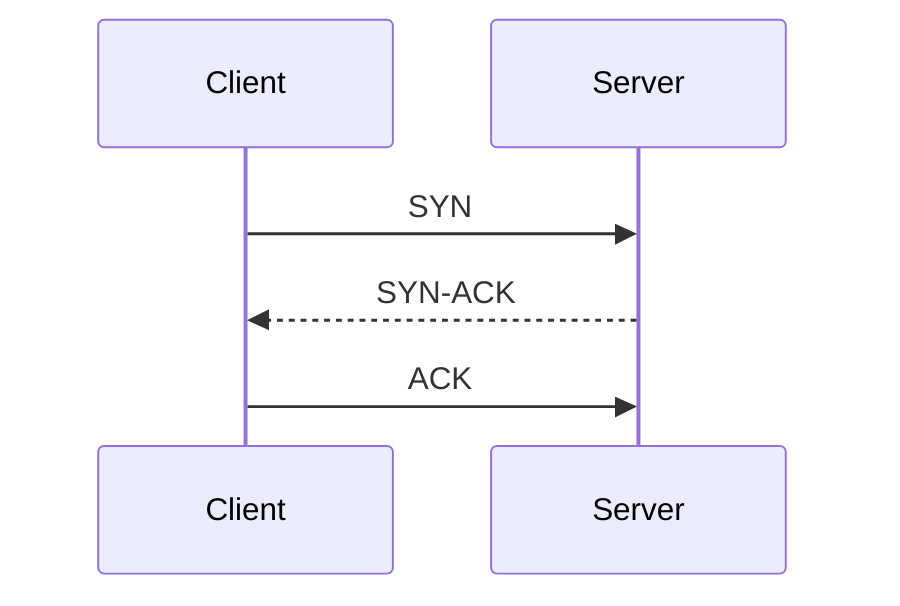
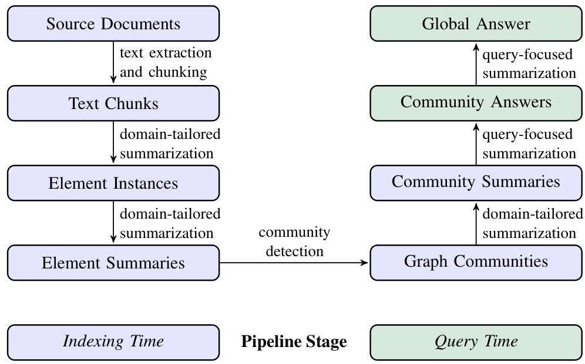
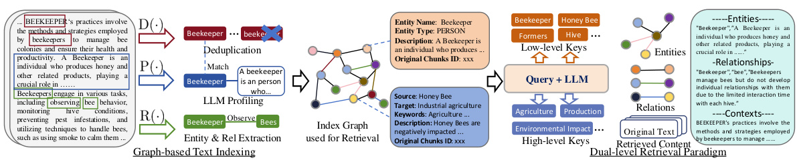

# Query and Answer Examples

## Example 1: No retrieval

### Query

Explain how TCP establishes a connection through the three-way handshake, and include diagrams to illustrate the process.

### Answer

> Direct query detected. No further retrieval needed.

TCP establishes a connection using a process known as the three-way handshake. This protocol ensures that both the client and server are ready to communicate before data transfer begins. Here’s how it works:

1. **SYN**: The client sends a synchronize (SYN) packet to the server to request a connection.

2. **SYN-ACK**: The server responds with a synchronize-acknowledge (SYN-ACK) packet, indicating that it has received the client's request and is ready to establish a connection.

3.  **ACK**: The client sends back an acknowledge (ACK) packet to the server, confirming that it received the server's response.

After these three steps, the connection is established, and data can be transferred between the client and server.

Here’s a diagram that illustrates the three-way handshake process:

This sequence diagram visualizes the flow of messages during the TCP three-way handshake.

## Example 2: Answering with images

### Query

In the paper, what is the overall architecture of Graph RAG? Please provide an architecture diagram and explain it.

### Answer

>Extracted keywords from the query:
>
>Graph RAG, overall architecture, architecture diagram

The overall architecture of **Graph Retrieval-Augmented Generation (Graph RAG)** can be outlined as a multi-stage pipeline designed to efficiently process and retrieve information from large datasets. This architecture combines the principles of retrieval-augmented generation with a focus on entity and relationship extraction, facilitated by graph structures. 

#### Architecture Diagram

Here is an architecture diagram of the Graph RAG pipeline:

#### Explanation of the Architecture

1. **Indexing Time:**
   - **Source Documents:** The process begins with obtaining source documents containing the relevant text data. This includes text extraction and chunking to create manageable segments of information.
   - **Text Chunks:** The extracted text is chunked into smaller pieces that allow for targeted analysis.
   - **Element Instances:** Each chunk undergoes domain-tailored summarization, creating instances of the key elements (entities and relationships) identified within the document.
   - **Element Summaries:** Further summarization of these instances is performed to consolidate information and prepare it for efficient querying. 

2. **Query Time:**
   - **Community Detection:** Utilizing community detection algorithms, the system organizes the identified elements into communities based on relatedness. This step enhances the overall relevance of retrieved information.
   - **Community Answers:** Based on the identified communities, query-focused summarization is performed to generate answers relevant to the user's query.
   - **Global Answer:** A final, comprehensive summary is constructed by aggregating the community summaries into a single coherent response.

#### Functional Components

- **Retrieval Component:** Responsible for fetching relevant information from the knowledge base during the query phase, based on the input query.
- **Generation Component:** This component utilizes the retrieved information to generate contextually relevant responses.
- **Self-Recollection:** This aspect of the architecture helps retain and utilize past information to improve future responses.

This architecture emphasizes the importance of both the indexing phase for pre-processing data and the query phase for obtaining detailed and user-relevant answers. The use of graph structures facilitates understanding complex interdependencies among entities, improving the comprehensiveness and contextual relevance of the generated responses.

## Example 3: Query with Image Input

### Query

This is an architecture diagram of a RAG system using a multimodal knowledge graph, MMKG-RAG. Please provide an overview of MMKG-RAG and the Graph RAG and Light RAG proposed in the paper, focusing on the aspects of knowledge graph construction and retrieval-based question answering, and highlight their differences with their architecture diagrams. Thank you!

### Answer

#### Overview of MMKG-RAG, Graph RAG, and Light RAG

##### MMKG-RAG
MMKG-RAG utilizes a multi-modal knowledge graph to enhance retrieval-augmented generation (RAG) systems. It integrates textual and visual data, extracting entities, relationships, and images, to form a comprehensive knowledge base. The process involves deduplication and the linking of text entities with their corresponding images, providing enriched content for the large language model (LLM) to generate responses.

##### Graph RAG
Graph RAG focuses on enhancing question answering by constructing a knowledge graph from text via entity and relationship extraction. It uses community detection to organize data into graph structures, optimizing summarization and response generation. This method improves accuracy and performance at a reduced token cost compared to conventional approaches.

**Architecture Diagram** for Graph RAG:
- **Indexing Time**: Source documents are chunked, summarized, and converted into "Element Instances" and "Element Summaries."
- **Query Time**: Involves query-focused summarization, producing "Global Answer" and "Community Answers."

- Key components include text chunking, entity summarization, community detection, and multi-stage answer generation.

##### Light RAG
Light RAG introduces a dual-level retrieval paradigm, which includes low-level retrieval for precise entity data and high-level retrieval for broader topic insights. It is designed for efficiency and adaptability, using graph-based text indexing and allowing for dynamic updates from incremental knowledge databases.

**Architecture Diagram** for Light RAG:
- Framework includes deduplication, LLM profiling, and entity-relation extraction.
- Utilizes an "Index Graph" linked with queries to optimize retrieval efficiency.

- Highlights include graph-based indexing, a dual-level retrieval key system, and seamless LLM integration.

#### Key Differences

- **Knowledge Graph Construction**:
  - **Graph RAG**: Focuses heavily on extracting and structuring relationships through community aggregation, using an iterative retrieval-generation strategy.
  - **Light RAG**: Emphasizes efficient data retrieval and adaptation using advanced graph structures and incremental updates.
  
- **Retrieval Strategy**:
  - **Graph RAG**: Utilizes query-focused summarization and community detection for comprehensive answer generation.
  - **Light RAG**: Employs a dual-level retrieval paradigm, balancing specific and topical information extraction.

In conclusion, while both Graph RAG and Light RAG leverage knowledge graphs, Light RAG is more optimized for rapid updates and diverse data processing, whereas Graph RAG excels in detailed, community-driven analysis and summarization.
